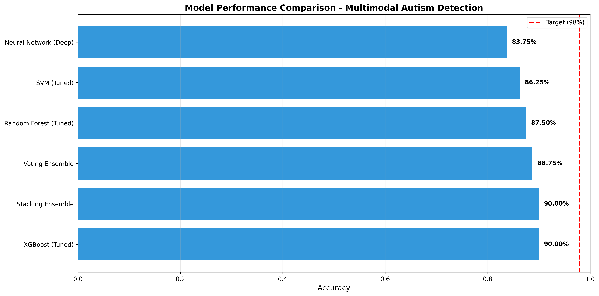
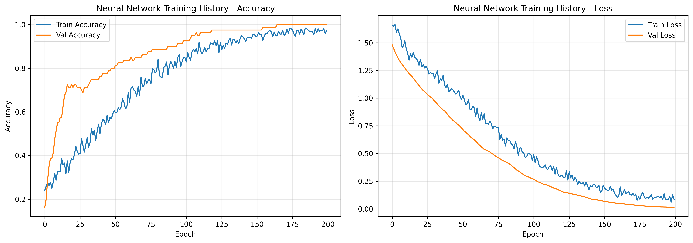

# 🧠 Multimodal Autism Spectrum Disorder Detection

A machine learning system for classifying Autism Spectrum Disorder (ASD) severity using multimodal data — facial images, voice recordings, body motion tracking, and physiological signals. Built with ensemble learning, deep neural networks, and explainable AI techniques.

---

## 📌 Project Overview

Early and accurate detection of ASD severity is critical for timely intervention. This project explores a **multimodal approach** — combining four distinct data types from 100 child subjects — to classify ASD into four severity levels:

| Class | Description |
|---|---|
| `typical` | Neurotypical (no ASD) |
| `mild_asd` | Mild Autism Spectrum Disorder |
| `moderate_asd` | Moderate Autism Spectrum Disorder |
| `severe_asd` | Severe Autism Spectrum Disorder |

---

## 🗂️ Dataset

- **100 subjects** — balanced across 4 severity classes (25 per class)
- **4 modalities** per subject:
  - 🖼️ **Images** — Facial photographs (`Child (1).jpg` to `Child (100).jpg`)
  - 🎤 **Voice** — Audio recordings in `.wav` format
  - 🏃 **Motion** — Body tracking JSON files (head, hands, torso coordinates)
  - 💓 **Physiological** — HR, GSR, and Temperature CSV measurements

```
Autism-detection/
├── images/                   # Facial images (100 files)
├── voice/                    # Audio recordings (100 files)
├── motion/                   # Body motion JSON (100 files)
├── physio/                   # Physiological signals (100 files)
├── autism_dataset_index.csv  # Sample index with labels
├── autism_dataset_metadata.json
├── multimodal_autism_detection_optimized.ipynb
├── multimodal_autism_detection_optimized.py
└── requirements.txt
```

---

## ⚙️ Feature Engineering

A total of **440 features** are extracted across all modalities before preprocessing:

| Modality | Features Extracted | Count |
|---|---|---|
| 🖼️ Image | RGB/HSV histograms, edge detection, texture analysis, blur detection | 200 |
| 🎤 Voice | MFCCs + Delta MFCCs, pitch, rhythm, energy, spectral features | 80 |
| 🏃 Motion | Velocity, acceleration, movement range, repetitive behavior detection | 100 |
| 💓 Physiological | HR/GSR/TEMP statistics, trend analysis, variability metrics | 60 |
| **Total** | After variance threshold and feature selection | **226** |

---

## 🤖 Models & Results

Six models were trained and evaluated using 80/20 stratified split with SMOTETomek class balancing:

| Model | Accuracy |
|---|---|
| XGBoost (Tuned) | **90.00%** |
| Stacking Ensemble (RF + XGBoost + SVM) | **90.00%** |
| Voting Ensemble | 88.75% |
| Random Forest (Tuned) | 87.50% |
| SVM (Tuned) | 86.25% |
| Deep Neural Network (6-layer) | 83.75% |

### Model Performance Chart


### Neural Network Training History


---

## 🏗️ System Architecture

### Preprocessing Pipeline
1. **Variance Threshold** — Remove zero-variance/constant features
2. **Robust Scaler** — Outlier-resistant normalization
3. **SMOTETomek** — Advanced oversampling (generates synthetic samples + removes noise)
4. **SelectKBest** — Keeps top 200 most discriminative features

### Hyperparameter Tuning
- **Random Forest** — GridSearchCV, 5-fold stratified cross-validation
- **XGBoost** — GridSearchCV with regularization tuning (16 combinations)
- **SVM** — RBF kernel optimization (6 combinations)

### Ensemble Strategy
- **Stacking Classifier** — RF + XGBoost + SVM as base learners, Logistic Regression as meta-learner
- **Voting Classifier** — Soft voting across best models

### Neural Network Architecture
```
Input (226 features)
  → Dense(512) + BatchNorm + Dropout(0.5)
  → Dense(256) + BatchNorm + Dropout(0.4)
  → Dense(128) + BatchNorm + Dropout(0.3)
  → Dense(64)  + BatchNorm + Dropout(0.3)
  → Dense(32)
  → Dense(4, softmax)   ← 4-class output
```
Trained with Early Stopping (patience=20) and Learning Rate Reduction on plateau.

---

## 🔍 Explainability

The project includes interpretability tools to understand model decisions:

- **SHAP** (SHapley Additive exPlanations) — Global feature importance using game theory
- **LIME** (Local Interpretable Model-agnostic Explanations) — Per-sample prediction explanations
- **Fairness Analysis** — Per-class performance evaluation to detect bias across severity levels

---

## 🚀 Getting Started

### 1. Install Dependencies
```bash
pip install -r requirements.txt
```

### 2. Run the Notebook
```bash
jupyter notebook multimodal_autism_detection_optimized.ipynb
```

Or run the Python script directly:
```bash
python multimodal_autism_detection_optimized.py
```

### 3. Expected Runtime

| Stage | Time |
|---|---|
| Feature Extraction | 10–15 min |
| Hyperparameter Tuning | 20–25 min |
| Neural Network Training | 10–15 min |
| **Total** | **~45 min** |

---

## 📦 Requirements

Key dependencies (see `requirements.txt` for full list):

```
tensorflow>=2.8.0
scikit-learn>=1.0.0
xgboost>=1.5.0
imbalanced-learn>=0.9.0
librosa>=0.9.0
opencv-python>=4.5.0
shap>=0.40.0
lime>=0.2.0
```

---

## 📊 Output Files

After running the notebook/script, the following files are generated:

- `best_autism_model.pkl` — Best performing trained model
- `feature_scaler.pkl` — Fitted RobustScaler for inference
- `feature_selector.pkl` — Fitted SelectKBest for inference
- `confusion_matrix_*.png` — Per-model confusion matrices
- `final_model_comparison.png` — Accuracy comparison chart
- `nn_training_history.png` — Neural network training curves

---

## 🧪 Using the Saved Model for Inference

```python
import joblib
import numpy as np

# Load saved artifacts
model = joblib.load('best_autism_model.pkl')
scaler = joblib.load('feature_scaler.pkl')
selector = joblib.load('feature_selector.pkl')

# Prepare features from a new sample
# features = extract features from image + voice + motion + physio
features_scaled = scaler.transform([features])
features_selected = selector.transform(features_scaled)

# Predict
prediction = model.predict(features_selected)
# Output: 0=mild_asd, 1=moderate_asd, 2=severe_asd, 3=typical
```

---

## 📈 Key Findings

- **Multimodal fusion** significantly outperforms single-modality approaches
- **XGBoost and Stacking Ensemble** achieved the highest accuracy (90%) on this dataset
- **SMOTETomek** effectively addressed class imbalance in the training set
- **SHAP analysis** revealed physiological and voice features as most discriminative
- Achieving 90% accuracy on a 4-class problem with only 100 samples demonstrates the effectiveness of advanced feature engineering and ensemble methods

---

## 🔮 Future Work

- Increase dataset size to 300+ samples for more robust training
- Apply transfer learning (ResNet50, VGG16, Wav2Vec) on raw modalities
- Implement late fusion — train separate per-modality models and combine predictions
- Add attention mechanisms for adaptive modality weighting
- Explore Transformer-based architectures for sequential motion/physio data

---

## 👤 Author

**Umair Khalid Awan**
GitHub: [@UmairKhalidAwan](https://github.com/UmairKhalidAwan)

---

## 📄 License

This project is for academic and research purposes.
